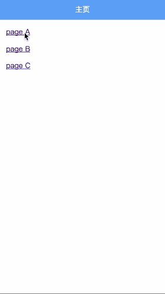

# vue-page-switch

> 使用 vue-router 完成 webApp 页面转场效果

## 运行

``` bash
# install dependencies
npm install

# serve with hot reload at localhost:8085
npm run dev
```
## 效果演示


## 难点

难点在于如何判断页面**前进后退**，根据此状态来切换动画效果

## 解决方案

记录 vue-router history 模式下特有 的 **window.history.state.key** ，页面后退时判断当前路由的 key 值与记录的 key 值是否相等，从而切换动画。

## 一些技巧

本 demo 的动画切换是用在了根路由，如果某些页面切换不需要动画，可以使用子路由，又或者在 meta 中设置标识来判断。

## 未解决

本 demo 解决了后退的问题，但还没解决前进的问题，希望有大神指点🤓